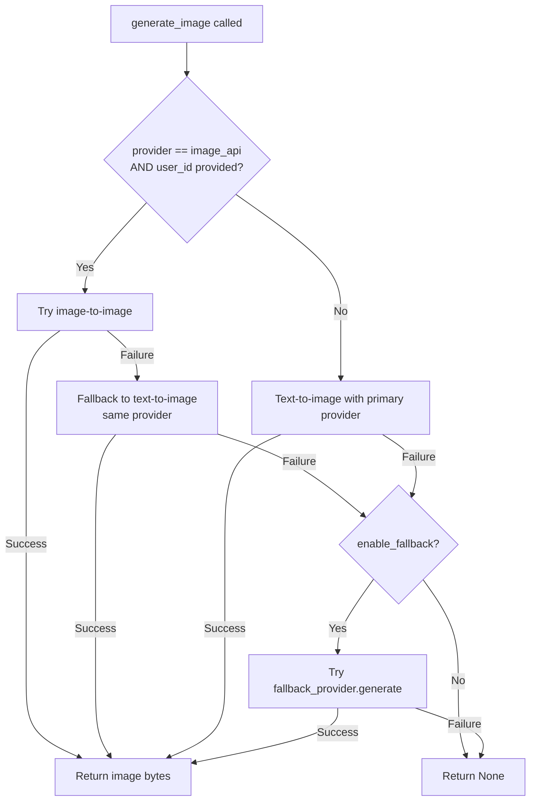

# Design Document: Image-API Provider

## Overview

本设计为 AI 伴侣项目新增 `image_api` 图片生成提供商，接入本地部署的 Images API 服务（基于 Jimeng 即梦平台）。核心能力包括：

1. **文生图 (Text-to-Image)**：通过 `/v1/images/generations` 端点生成图片
2. **图生图 (Image-to-Image)**：通过 `/v1/images/compositions` 端点，基于用户底图 + 提示词生成保持外观一致性的图片
3. **用户底图管理**：每用户一张底图，支持上传/查看/删除，图生图时自动使用
4. **自动触发集成**：当 provider 为 `image_api` 时，`ImageGenerationManager` 自动走图生图流程

设计遵循现有 provider 模式（继承 `BaseImageProvider`），通过 provider-name-to-class 映射注册，对现有代码侵入最小。

## Architecture

```mermaid
graph TB
    subgraph Frontend
        UI[Web Frontend]
    end

    subgraph Backend API Layer
        API_IMG[/api/image-gen/generate]
        API_BASE[/api/image-gen/base-image/*]
    end

    subgraph Core
        BOT[Bot.generate_image]
        MGR[ImageGenerationManager]
    end

    subgraph Providers
        MS[ModelScopeProvider]
        YW[YunwuProvider]
        KL[KlingApiProvider]
        IA[ImageApiProvider - NEW]
    end

    subgraph Base Image Logic
        BIS[BaseImageService - NEW]
        UDM[UserDataManager]
    end

    subgraph External
        IAPI[Images API Service :18081]
    end

    UI --> API_IMG
    UI --> API_BASE
    API_IMG --> BOT
    API_BASE --> BIS
    BOT --> MGR
    MGR --> MS
    MGR --> YW
    MGR --> KL
    MGR --> IA
    IA --> IAPI
    MGR --> BIS
    BIS --> UDM
```

### 关键设计决策

1. **扩展 `BaseImageProvider` 接口**：新增 `generate_with_images(prompt, images)` 方法用于图生图，默认实现回退到 `generate(prompt)`，保持向后兼容。
2. **独立 `BaseImageService` 类**：将底图管理逻辑（文件存储、格式验证、data URL 转换）封装为独立服务，不污染 `UserDataManager`。
3. **Manager 层集成**：`ImageGenerationManager.generate_image` 新增可选 `user_id` 参数，当 provider 为 `image_api` 时自动获取底图并调用图生图。
4. **Provider 注册映射表**：将 `_create_provider` 中的 if-else 重构为字典映射，便于扩展。

## Components and Interfaces

### 1. ImageApiConfig (Pydantic Model)

新增配置模型，添加到 `ImageGenerationConfig`。

```python
class ImageApiConfig(BaseModel):
    """Image API 本地服务配置"""
    api_base: str = "http://127.0.0.1:18081"
    api_key: str = ""
    model: str = "jimeng-4.5"
    timeout: int = 120
    ratio: str = "1:1"
    resolution: str = "2k"
    sample_strength: float = 0.5
```

### 2. ImageApiProvider (Provider Class)

```python
class ImageApiProvider(BaseImageProvider):
    """Image API 图像生成提供商"""

    SUPPORTED_MODELS = {"jimeng-4.5", "jimeng-4.6", "jimeng-5.0"}

    def __init__(self, config: Dict[str, Any]): ...
    async def generate(self, prompt: str) -> Optional[bytes]: ...
    async def generate_with_images(self, prompt: str, images: List[str]) -> Optional[bytes]: ...
    async def test_connection(self) -> bool: ...
```

### 3. BaseImageProvider (Extended Interface)

```python
class BaseImageProvider(ABC):
    @abstractmethod
    async def generate(self, prompt: str) -> Optional[bytes]: ...

    async def generate_with_images(self, prompt: str, images: List[str]) -> Optional[bytes]:
        """图生图，默认回退到文生图"""
        return await self.generate(prompt)

    @abstractmethod
    async def test_connection(self) -> bool: ...
```

### 4. BaseImageService (New Service)

```python
class BaseImageService:
    """用户底图管理服务"""

    ALLOWED_FORMATS = {".jpg", ".jpeg", ".png", ".webp"}
    MAX_FILE_SIZE = 5 * 1024 * 1024  # 5MB
    MAX_READ_SIZE = 10 * 1024 * 1024  # 10MB
    READ_TIMEOUT = 5.0  # seconds
    BASE_IMAGE_DIR = "base_image"

    def __init__(self, user_data_manager: UserDataManager, fallback_image_path: str): ...
    async def upload_base_image(self, username: str, file_data: bytes, filename: str) -> Dict: ...
    async def get_base_image(self, username: str) -> Optional[Dict]: ...
    async def delete_base_image(self, username: str) -> bool: ...
    async def get_base_image_data_url(self, username: str) -> Optional[str]: ...
    async def get_effective_base_image_data_url(self, username: str) -> Optional[str]: ...
```

### 5. ImageGenerationManager (Modified)

```python
class ImageGenerationManager:
    PROVIDER_MAP = {
        "modelscope": (ModelScopeProvider, "modelscope"),
        "yunwu": (YunwuProvider, "yunwu"),
        "kling_api": (KlingApiProvider, "kling_api"),
        "image_api": (ImageApiProvider, "image_api"),
    }

    async def generate_image(self, prompt: str, user_id: Optional[str] = None) -> Optional[bytes]: ...
```

### 6. REST API Endpoints (New)

| Method | Path | Description |
|--------|------|-------------|
| POST | `/api/image-gen/base-image/upload` | 上传底图（multipart） |
| GET | `/api/image-gen/base-image` | 获取当前底图 |
| DELETE | `/api/image-gen/base-image` | 删除底图 |

## Data Models

### Configuration (config.yaml)

```yaml
image_generation:
  provider: "image_api"
  fallback_provider: "yunwu"
  enable_fallback: true
  image_api:
    api_base: "http://127.0.0.1:18081"
    api_key: ""
    model: "jimeng-4.5"
    timeout: 120
    ratio: "1:1"
    resolution: "2k"
    sample_strength: 0.5
  default_base_image_path: "backend/data/default_base_image.jpg"
```

### ImageApiConfig (Pydantic)

```python
class ImageApiConfig(BaseModel):
    api_base: str = "http://127.0.0.1:18081"
    api_key: str = ""
    model: str = "jimeng-4.5"  # jimeng-4.5 | jimeng-4.6 | jimeng-5.0
    timeout: int = 120
    ratio: str = "1:1"
    resolution: str = "2k"
    sample_strength: float = Field(default=0.5, ge=0.0, le=1.0)
```

### User Data Directory Structure

```
user_data/
└── {username}/
    ├── config.yaml
    ├── images/
    ├── base_image/          ← NEW: 底图存储目录
    │   └── avatar.jpg       ← 最多一个文件
    ├── logs/
    ├── uploads/
    └── voice_samples/
```

### Base Image API Response Models

```python
class BaseImageUploadResponse(BaseModel):
    success: bool
    message: str
    filename: Optional[str] = None
    file_size: Optional[int] = None
    mime_type: Optional[str] = None

class BaseImageGetResponse(BaseModel):
    success: bool
    message: str
    image_data: Optional[str] = None  # Base64 encoded
    filename: Optional[str] = None
    file_size: Optional[int] = None
    mime_type: Optional[str] = None
    last_modified: Optional[str] = None  # ISO timestamp
```

### Text-to-Image Request Payload

```python
{
    "model": "jimeng-5.0",
    "prompt": "<enhanced_prompt>",
    "ratio": "1:1",
    "resolution": "2k",
    "n": 1,
    "response_format": "url"
}
```

### Image-to-Image Request Payload

```python
{
    "model": "jimeng-5.0",
    "prompt": "<enhanced_prompt>",
    "images": ["data:image/jpeg;base64,<encoded_data>"],
    "ratio": "1:1",
    "resolution": "2k",
    "sample_strength": 0.5,
    "n": 1,
    "response_format": "url"
}
```

## Correctness Properties

*A property is a characteristic or behavior that should hold true across all valid executions of a system—essentially, a formal statement about what the system should do. Properties serve as the bridge between human-readable specifications and machine-verifiable correctness guarantees.*

### Property 1: sample_strength validation

*For any* float value, the `ImageApiConfig` SHALL accept it if and only if it falls within the range [0.0, 1.0] inclusive; values outside this range SHALL be rejected with a validation error.

**Validates: Requirements 1.4**

### Property 2: Text-to-image request construction

*For any* valid non-empty prompt string, the `ImageApiProvider.generate()` method SHALL construct a POST request to `{api_base}/v1/images/generations` containing the configured `model`, the provided `prompt`, and the configured `ratio`, `resolution`, and `response_format` fields.

**Validates: Requirements 2.1**

### Property 3: Response extraction produces valid JPEG

*For any* valid image binary data, when the Images API returns it either as a downloadable URL or as a b64_json encoded string in the response data array, the provider SHALL decode/download and return valid JPEG binary data.

**Validates: Requirements 2.3, 2.4, 3.3**

### Property 4: Non-200 status returns None

*For any* HTTP status code outside the 200 range (400-599), when the Images API responds with that status, the provider's `generate()` method SHALL return None.

**Validates: Requirements 2.5**

### Property 5: Image-to-image request construction

*For any* valid prompt and reference image array containing 1 to 10 elements (each being a valid URL or data URL), the `ImageApiProvider.generate_with_images()` method SHALL construct a POST request to `{api_base}/v1/images/compositions` containing `model`, `prompt`, `images`, `ratio`, `resolution`, and `sample_strength` fields.

**Validates: Requirements 3.1**

### Property 6: Base image upload-view round trip

*For any* valid image file (JPEG, PNG, or WebP format, ≤5MB), after uploading it as a user's base image, requesting to view the base image SHALL return the same binary data and correct metadata (filename, size, MIME type).

**Validates: Requirements 4.2, 4.5**

### Property 7: Base image replacement

*For any* sequence of valid base image uploads for the same user, after each upload only one file SHALL exist in the user's base_image directory, and it SHALL be the most recently uploaded file.

**Validates: Requirements 4.3**

### Property 8: Format validation rejects unsupported formats

*For any* file with an extension not in {.jpg, .jpeg, .png, .webp}, the base image upload SHALL reject the file and return an error indicating unsupported format.

**Validates: Requirements 4.4, 6.5**

### Property 9: Base image deletion removes file

*For any* user who has an uploaded base image, after deletion the base_image directory SHALL contain no image files, and subsequent view requests SHALL indicate no image exists.

**Validates: Requirements 4.7**

### Property 10: Base image selection and data URL conversion

*For any* user with a valid uploaded base image file (JPEG, PNG, or WebP), the base image selection logic SHALL read the file, determine its MIME type from the extension, and produce a string matching the pattern `data:image/{type};base64,{valid_base64_data}`.

**Validates: Requirements 5.1, 5.2**

### Property 11: Model validation and pass-through

*For any* string value, the `ImageApiProvider` SHALL accept it as a model configuration if and only if it is one of {"jimeng-4.5", "jimeng-4.6", "jimeng-5.0"}; accepted values SHALL appear unchanged in API request payloads; rejected values SHALL not alter the current model setting.

**Validates: Requirements 7.1, 7.2, 7.3**

### Property 12: Image-to-image auto-trigger with base image

*For any* user who has a valid base image, when image generation is triggered with provider="image_api" and a valid user_id, the `ImageGenerationManager` SHALL call `generate_with_images` with the user's base image data URL and the provided prompt.

**Validates: Requirements 8.1**

### Property 13: I2I failure falls back to T2I

*For any* failed image-to-image call (returns None or raises exception), the `ImageGenerationManager` SHALL attempt text-to-image generation with the same provider and prompt before trying the fallback provider.

**Validates: Requirements 8.4**

### Property 14: Connection test failure detection

*For any* response from the ping endpoint that is not HTTP 200 with JSON body `{"ok": true}` (including network errors, timeouts, non-200 status, non-JSON body, or missing/false "ok" field), the `test_connection()` method SHALL return False.

**Validates: Requirements 9.3**

## Error Handling

### Provider-Level Errors

| Error Condition | Behavior | Fallback |
|----------------|----------|----------|
| Network timeout (connect/read) | Log error, return None | Manager tries fallback provider |
| Non-200 HTTP response | Log status + body, return None | Manager tries fallback provider |
| Invalid JSON response | Log parse error, return None | Manager tries fallback provider |
| Empty data array | Log warning, return None | Manager tries fallback provider |
| Image download failure | Log URL + error, return None | Manager tries fallback provider |
| Base64 decode failure | Log error, return None | Manager tries fallback provider |

### Base Image Errors

| Error Condition | Behavior | Fallback |
|----------------|----------|----------|
| User has no base image | Use system fallback image | If fallback missing, use T2I |
| System fallback image missing | Log warning | Use text-to-image instead |
| Base image file unreadable | Log warning | Use text-to-image instead |
| Base image > 10MB | Log warning | Use text-to-image instead |
| Base64 encoding timeout (>5s) | Log warning | Use text-to-image instead |

### Manager-Level Fallback Chain



### API Endpoint Errors

| Endpoint | Error | HTTP Status | Response |
|----------|-------|-------------|----------|
| POST /upload | No auth | 401 | `{"detail": "未授权"}` |
| POST /upload | Invalid format | 400 | `{"detail": "不支持的格式，仅支持 JPEG/PNG/WebP"}` |
| POST /upload | File too large | 400 | `{"detail": "文件大小不能超过 5MB"}` |
| GET /base-image | No auth | 401 | `{"detail": "未授权"}` |
| GET /base-image | No image | 404 | `{"detail": "未上传底图"}` |
| DELETE /base-image | No auth | 401 | `{"detail": "未授权"}` |
| DELETE /base-image | No image | 404 | `{"detail": "未上传底图"}` |

## Testing Strategy

### Property-Based Tests (Hypothesis)

使用 Python `hypothesis` 库进行属性测试，每个属性最少 100 次迭代。

**测试范围：**
- `ImageApiConfig` 的 `sample_strength` 验证（Property 1）
- 请求构造正确性（Property 2, 5）
- 响应解析 — URL/b64 → JPEG（Property 3）
- 错误状态码处理（Property 4）
- 底图上传-查看往返（Property 6）
- 底图替换幂等性（Property 7）
- 格式验证（Property 8）
- 底图删除（Property 9）
- Data URL 转换（Property 10）
- 模型验证（Property 11）
- I2I 自动触发（Property 12）
- I2I 失败回退（Property 13）
- 连接测试失败检测（Property 14）

**Property test configuration:**
- Library: `hypothesis` (Python)
- Minimum iterations: 100 per property
- Tag format: `# Feature: image-api-provider, Property {N}: {title}`

### Unit Tests (pytest)

**Example-based tests for:**
- Provider registration in manager (Req 1.1, 1.2)
- Default config values (Req 1.3)
- API key header inclusion/omission (Req 2.2)
- Async task polling flow (Req 3.5)
- Base image directory creation (Req 4.1)
- Fallback image usage (Req 5.3, 5.4)
- API endpoint existence and auth (Req 6.1-6.4)
- Connection test success case (Req 9.1, 9.2)

### Integration Tests

- End-to-end: upload base image → trigger generation → verify i2i called with correct data URL
- Config reload: update config.yaml → verify manager picks up new provider
- Fallback chain: mock primary failure → verify fallback provider is tried

### Edge Case Tests

- Invalid config raises ValueError (Req 1.5)
- Network errors return None (Req 2.6)
- Composition errors return None (Req 3.4)
- No base image → 404 response (Req 4.6, 6.7)
- Neither user nor fallback image → T2I fallback (Req 5.5)
- Unreadable/oversized base image → T2I fallback (Req 5.6)
- Encoding timeout → T2I fallback (Req 5.7)
- File size > 5MB → 400 (Req 6.6)
- All providers fail → None (Req 8.5)
